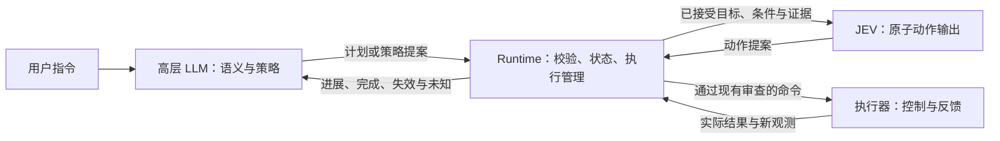

# 高层 LLM、JEV 与 Runtime 架构联合审查

日期：2026-10-06。主 agent 与 `architecture_review` 协作 agent 独立读代码、交叉质疑后形成。协作角色按研究审查分工，不代表任何真实高校身份。

本轮是架构评审：不改生产代码，不调用在线模型，不执行机器人动作，不新增任务回合，不更新成功率。源码、测试、配置和场景前后哈希见 [manifest.json](../runs/system2_system1_runtime_review_20261006/manifest.json)。此前意图生命周期修复不重复实施；重试继续暂缓。

[current_stage_plan.md](current_stage_plan.md) 仍是已确认阶段计划入口。本文是根据用户新提出的三方职责做的修订建议，尚未替换该计划；尤其把接近策略从 JEV 移到高层，需要后续确认与实现，不能当成当前行为。

## 结论与证据边界

用户希望的三方分工合理：高层 LLM 做语义解释和策略决策，JEV 输出动作，Runtime 依据证据管理执行与状态。当前实现尚未形成这套分工。

已确认的核心不足是：高层模型入口缺失，动作层接收的条件表达不完整，持续约束缺少统一的可计算状态，策略选择的约束强度未明确。它们足以支持接口修复，但不能被认定为十项任务失败的唯一根因。

两位 agent 共同纠正了上一版建议：“统一合同”是必要条件，但还需要规定模型能承诺什么、Runtime 能核验什么，以及计划提案何时成为执行中的目标。增加一个高层模型不能替代执行器、接触证据和几何估计的独立诊断。

## 1. 当前实现实际上是什么

| 代码事实 | 证据 | 意义 |
| --- | --- | --- |
| 两阶段模式由同一个 JEV 先选择局部意图，再选择动作，使用同一客户端和 `jev-1.13.0`。 | [jev.py:22](../src/jev4mujoco/policies/jev.py#L22)、[jev.py:265](../src/jev4mujoco/policies/jev.py#L265)、[jev.py:298](../src/jev4mujoco/policies/jev.py#L298) | `jev_stages=2` 不等于独立高层 LLM 加动作模型。 |
| Runtime 初始化时通过预设或计划构建函数得到 TaskPlan，再调用确定性编译器。运行入口在模型安装前保存计划和能力程序。 | [loop.py:184](../src/jev4mujoco/runtime/loop.py#L184)、[run_v1.py:171](../scripts/run_v1.py#L171) | 高层决策目前主要在预设、构建函数和编译模板中。 |
| 能力程序是有序实例列表，阶段内由 Runtime 核验并推进。 | [capabilities.py:405](../src/jev4mujoco/planning/capabilities.py#L405)、[transitions.py:149](../src/jev4mujoco/runtime/transitions.py#L149) | 有能力内部执行语义；尚无在线高层计划修订协议。 |
| TaskPlan 可用 ordered_sequence 组合非序列注册任务；子任务仍按固定模板展开，使用同一个初始场景。 | [task_plan.py:337](../src/jev4mujoco/contracts/task_plan.py#L337)、[compiler.py:406](../src/jev4mujoco/planning/compiler.py#L406) | 并非只能选择十二个实验，但也不是任意能力链、自由路径或动态规划接口。 |

TaskPlan 当前适合表达注册任务的对象、关系、顺序和组合。它没有直接暴露任意 transport/place 子任务、自由中间路径点、分支/循环或中途替换计划。内部 CapabilityProgram 能容纳能力列表，不代表当前对外规划入口已支持这些能力。

确定性编译本身合理，应保留。把模型决定展开成已有能力、绑定对象并检查执行条件，属于执行语义；不应让模型自由生成验证器、阶段代码或数值阈值。

## 2. 已确认的问题集中在哪里

### 2.1 局部目标与阶段条件没有完整交给动作层

[jev_context.py:264](../src/jev4mujoco/policies/jev_context.py#L264) 对点意图仅保留阶段 ID 和 Runtime 结果；完整条件主要保留给 `phase_contract`、`contact_geometry` 类型。机器人、物理状态、主体和 maintain 名称仍存在，因此不能说 JEV 完全看不到约束。

具体不足是：模型看到局部距离如何减少，却未得到同等完整的“阶段还要求什么、哪些要求当前未知、哪些必须持续维持”的表达。局部距离减少只能证明该局部指标的预测进展，不能证明阶段完成、约束保持或执行器能达到命令。

### 2.2 持续约束目前主要是名称，执行状态没有统一表达

[phase_definitions.py:138](../src/jev4mujoco/planning/phase_definitions.py#L138) 的 maintain 是字符串元组。现有专用持有检查和几何审查仍有效；本次未发现覆盖所有 maintain 名称的通用逐条核验状态接口。

例如声明 avoid_other_objects，并不意味着已有完整路径碰撞预测。接口需要区分：测量缺失的 unknown、尚无核验实现的 unsupported、阶段不适用的 not_applicable。不能用 unknown 掩盖能力缺口，也不能把“未检测出问题”标成安全。

### 2.3 判定与反馈是两条路径，需要证明一致

实际阶段判定由 [verifier.py:208](../src/jev4mujoco/runtime/verifier.py#L208) 分派至专用处理器；条件列表由 [verifier.py:258](../src/jev4mujoco/runtime/verifier.py#L258) 从条件表及测量生成。

这是两条表达路径的事实，尚未证明它们当前存在普遍判定矛盾。仅向模型补字段不能保证一致。必须在相同新鲜状态、适用阶段及历史条件下对照；稳定观测次数、视觉新鲜度、绑定校验等附加判定也必须计入，不能简单把 conditions 全真当作通过。

### 2.4 策略偏好和执行承诺没有明确区分

[phase_definitions.py:197](../src/jev4mujoco/planning/phase_definitions.py#L197) 写“在所选侧面建立接触”，实际 [verifier.py:693](../src/jev4mujoco/runtime/verifier.py#L693) 检查主体接触、支撑、未持有与高度，没有核验实际接触侧。

这不自动构成错误验收。如果选侧只是接近偏好，实际阶段条件满足后结束旧路线可以合法；如果高层要求“必须从左侧推”，就需要侧面绑定和可核验接触证据。当前不能把后者当成已支持的硬约束。

此前已完成的意图终止与证据交接修复，解决“曾经选择”被错误继承为“已实现”的边界；它没有增加实际接触侧验收。这两项不能混为同一修复。

### 2.5 历史完成与当前目标成立必须同时保留

[state_builder.py:425](../src/jev4mujoco/runtime/state_builder.py#L425) 的 completed_subject_refs 根据能力历史完成状态生成，不能解释为对象当前仍满足目标。现有终检与独立评估继续保留；高层反馈还应明确呈现“曾完成”和“当前仍成立”，而不是改变历史记录来伪装一致。

### 2.6 单步进展规则有适用边界，尚未证明历史误拒

[loop.py:670](../src/jev4mujoco/runtime/loop.py#L670) 的 XY 审查要求预测误差下降至少指定量。它可用于直接对齐；若引入绕行，需可表达中间目标及审查作用域，否则朝最终目标距离短暂增加的合法动作无法表达。

这是扩展边界，不是历史任务发生绕行误拒的证据。已核对的旧对齐失败存在有效动作，JEV 选了低进展或增误差动作，不能为提高通过率撤掉相应审查。

### 2.7 当前接触证据包含仿真读数

[state_builder.py:279](../src/jev4mujoco/runtime/state_builder.py#L279) 明确记录 MuJoCo 接触来源，以及视觉、机器人反馈与仿真接触组合的持有/支撑来源。它们是当前可用证据，不代表纯视觉接触能力已验证，也不代表真实硬件可以直接复用。独立隐藏验收仍不得回流成策略真值。

## 3. 建议的职责与闭环

| 组件 | 应负责 | 权限边界 |
| --- | --- | --- |
| 高层 LLM | 解释指令、消歧、绑定对象与关系，选择任务组合和操作顺序；在能力允许时选接近策略与中间目标；根据证据解释进展和修订未来策略。 | 语义判断可以提出结论，但不能直接写物理事实、修改完成阈值或绕过核验宣布成功。 |
| JEV | 根据当前已接受目标、阶段条件、约束证据和近期动作结果输出原子动作；明确报告无法判断或缺少证据。 | 不自行修改最终任务目标、能力顺序或 Runtime 阶段。 |
| Runtime | 维护真实观测的证据和估计、校验引用与能力支持、编译计划、激活目标、核验阶段、约束作用域与任务当前目标、审查动作、管理生命周期。 | 可以提供候选和可执行性信息；不在后台替模型选策略，也不能声称它的规则能完全理解任意自然语言。 |
| 执行器 | 将已允许命令落成受限控制，报告实际位姿、接触相关反馈、完成或超时。 | 超时不等于高层语义错误；不得以命令已发送冒充动作已达到。 |

高层以阶段完成、明确失效、证据变化等事件获得反馈；动作层持续处理当前目标。初始版本可同步在安全动作边界调用高层，不必同时建设异步规划、自由程序和重试。

## 4. 三方共享接口需要表达什么

以下是评审设计，不是已实现 schema：

| 信息 | 含义与来源 |
| --- | --- |
| 目标身份与绑定 | 任务、能力实例、阶段、对象、参考对象/区域；动态更新引入计划版本和目标 ID。 |
| 最终任务目标 | 经接受的对象关系及目标集合，后续执行策略不得悄悄改写。 |
| 当前子目标 | 当前需要达成的关系或中间目标，区分局部路线完成与阶段通过。 |
| 开始条件 | 能力/阶段进入时需要具备的条件，不等同整个动作期间必须保持。 |
| 完成条件 | 尚待建立的条件，使用 Runtime 注册定义与配置；未满足时不能因此禁止建立该条件的动作。 |
| 持续约束 | 条件 ID、适用阶段/终止事件、当前状态、证据来源；与完成结果分开。 |
| 策略强度 | 偏好可由合法阶段完成覆盖；硬要求必须具有已注册核验能力，否则不得按已支持要求接受。 |
| 进展与预测 | 当前测量、动作预测、模型假设和适用范围；明确预测不是实际观测、路径已验证或成功保证。 |
| 失效与反馈 | 原因、发生阶段、所依证据及未知项；保留历史结果与当前状态的区别。 |

持续约束建议区分 satisfied、violated、unknown、unsupported、not_applicable。阶段结果仍使用自身 passed/pending/failed，不把这些状态合并成一个 allTrue 门槛。动作预测还需单独记录“能否预测该条件”；当前条件可观测不代表动作后果可预测。

沿用现有 PhaseConditionV1 的三态满足值，测量未知继续传播为 None。约束反馈要绑定同一能力、阶段、状态、动作 epoch 与观测 ID，并保留具体证据的新鲜度；不能拼接不同时间的几何和接触证据后宣称当前满足。candidate_grasp 与 grasp_candidate、subject_not_held 与 grasp_not_held 等名称映射需逐项确认语义，不能只按名称相似自动映射。

现有 maintain 的八类名称应逐项核对：subject_supported、avoid_other_objects、candidate_grasp、subject_held、placement_relation_until_release、subject_not_held、supported_push_contact、press_point_alignment。支撑/接触/持有状态有现有证据入口；候选抓持不能等同确认持有；关系维持需要释放事件边界；avoid_other_objects 缺乏完整核验实现时明确标 unsupported。第一轮不凭名称自行编造新硬约束或安全保证。

## 5. 高层计划提案与实际执行必须分开

先复用 TaskPlan 的注册任务组合入口接高层 LLM，可以验证指令到对象/关系/顺序的语义映射，但不能宣称已有自由能力规划。

当前 [task_plan.py:627](../src/jev4mujoco/contracts/task_plan.py#L627) 校验观测绑定、对象集合、区域类型和归属。通过这些检查不代表计划忠实于用户自然语言，也不代表物理可行。初始语义映射需要独立标注样例验收；歧义需要澄清。计划接受后冻结最终目标，后续模型修订策略不得改变该目标。

若之后开放动态策略，应新建“提案 → 能力/引用/作用域检查 → 接受 → 安全动作边界激活”的协议。已有 [loop.py:206](../src/jev4mujoco/runtime/loop.py#L206) 安装函数重建 Runtime、清局部意图与事件，不适合作为动态更新接口。

更新要保留历史，明确旧目标完成、替代或撤销；执行中动作不能同时被另一个目标改写。低层动作仍严格绑定状态与动作 epoch。高层提案校验应关注版本、对象和依赖的变化，不能因每次产生新 state_id 就机械地让较慢的规划永远过期。

## 6. 第一轮具体范围：先补表达与一致性证据

**建议下一次批准的实施范围仅为以下四步：**

1. 沿现有阶段定义和快照类型增补有作用域的条件/约束状态表达，保留 registered condition、现有阈值和证据来源；不更改判定权。
2. 由 Runtime 投影当前约束证据，区分未知、未支持和不适用；复用已有测量与检查，缺口如实暴露，不新增碰撞模型。
3. 给点意图与其他动作上下文提供一致的当前阶段条件、约束状态和证据边界；仍保留局部进展预测。
4. 对反馈条件与实际 verifier 做同输入正反例对照，记录附加历史/新鲜度要求；若发现分歧先解释原因，再单独确认行为改动。

优先扩展已有 test_runtime_correctness_round1.py 的条件一致性测试，补未知、过期观测与时间边界；不重复写一批镜像实现测试。新接口报告约束状态，不意味着已全面执行该约束；现有行为仍由原检查负责。

预计主要涉及 phase_definitions、state_snapshot、verifier 的反馈投影和 jev_context；具体变量与公式在实施前逐段核对。先定义结构，再填证据映射，最后接动作上下文与验证，不一次生成全部代码。

本轮范围不增加动作硬拒绝，不撤现有检查，不修改执行精度门槛，不新增模型，不开放动态计划，不改重试。它的直接成果是接口可检查与问题可归因，**不承诺仅此一步提高任务成功率**。

后续依次为：接入受限初始高层计划入口；根据能力边界把策略选择从 JEV 移至高层；再开放带版本的执行策略与当前子目标修订，保持已接受的最终任务目标。执行器超时、持有证据降级、视觉与隐藏几何偏差仍各有独立诊断轮次，不能等到高层模型接入后才把它们当作已修复。

## 7. 验收要同时保护合法过程与拒绝错误结论

| 正反例 | 预期证据 |
| --- | --- |
| 建立接触从未接触开始；推动中丢失需要保持的接触；撤离解除接触。 | 分别显示待达成条件、持续约束状态、阶段不适用；不以统一接触禁令阻断合法过程。 |
| 局部距离减少，但阶段高度或其他条件不满足。 | 只标预测局部进展，不标阶段完成；动作层看到未满足项。 |
| 阶段已合法通过，但旧偏好路线仍未到达。 | 保留现有意图终止语义；不凭旧偏好强制继续，也不继承未实现事实。 |
| 几何距离为零，没有实际接触证据。 | 接触完成不能由几何预测单独通过。 |
| 缺少测量，和根本没有该核验实现。 | 分别为 unknown 与 unsupported，均不伪造 satisfied 或碰撞安全。 |
| 释放阶段与之前的持有阶段。 | 持有要求按作用域结束，合法释放不成为自相矛盾的失败条件。 |
| 相同输入送入反馈条件与真实 verifier。 | 对照完成规则、绑定、新鲜度及历史条件；分歧可定位，不机械以全真替代权威处理器。 |

后续高层入口还需检查：合法计划编译、虚构对象/不支持能力/自改阈值拒绝、自然语言目标映射的独立验收、原目标不可被修订覆盖、旧版本提案不激活、动作执行中不换目标。先前对象完成后被后续操作移动时，历史完成与当前目标失效分别呈现，属于后续高层状态接口验收或已有终检的回归，不是第一轮新增的全部对象状态功能。自由路径和硬性接触侧要求在可表达且可核验前不得伪称支持。

接口测试、保存状态重放和模型决策重放不能算完整任务成功。之后的能力复测要使用相同版本、成功与失败对照、首次执行记录，分别归因高层提案、JEV 动作、Runtime 判定、证据与执行器；最终任务成功仍要求 Runtime 与独立验收同时通过。

## 8. 两人审查后的修正

| 候选设计或需防止的误解 | 协作质疑 | 最终决定 |
| --- | --- | --- |
| 统一合同后直接接高层即可。 | 模型承诺和 Runtime 可核验能力未对应；选侧是偏好还是硬要求不明确。 | 先表达状态和能力缺口，再限制可接受提案范围。 |
| 将完成条件和 maintain 合并成统一约束检查。 | 建立接触、闭合、释放可能被自己的目标条件禁止；未实现检查会冒充安全。 | 分开完成、持续约束、适用性与支持状态，第一轮不加新拒绝。 |
| 现有 TaskPlan 足以承载全部高层规划。 | 它能组合注册任务，但没有自由能力链、路径点和动态更新。 | 初始入口按实际能力命名，进一步策略表达分轮建设。 |
| Runtime 已检查计划，所以语义正确。 | 引用/类型合法不等于忠实于自然语言。 | 高层语义独立验收；接受后冻结原目标，Runtime守执行协议。 |

本报告提供修改前的具体评审范围。生产代码实施仍需用户按 AGENTS 规则批准。

2026-10-08 实施追记：用户批准后，第一步共享证据契约已完成，包含条件时效、具名持续约束、核验来源绑定与点意图完整条件投影；197 项回归通过。独立高层 LLM 与动态策略接口尚未实现，原评审中的后续设计仍为提案。见 [第一轮实施报告](phase_condition_contract_round1_20261008.md)。
